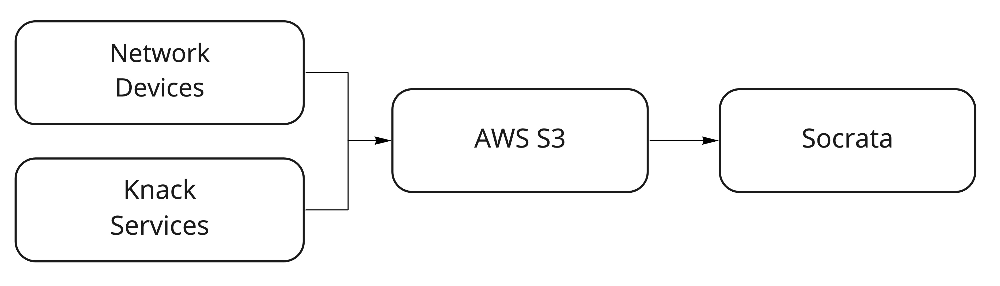

# atd-signal-comms

Tools for logging the status of HTTP-enabled devices on the traffic signals network and publishing the results on the City's [Open Data Portal](data.austintexas.gov).



## Contents

- [Design](#design)
- [Installation](#installation)
- [Configuration](#configuration)
- [Usage](#scripts)

## Design

Todo: file format. idempotency.

## Installation

In your own Python environment:

```shell
$ pip install -r requirements.txt
```

or Docker

```shell
$ docker build -t atd-signal-comms .
```

## Configuration

Each device type to be pinged must have an entry defined in `config.CONFIG`.

- `device_type`: A unique `str` identifier the device type.
- `container`: A Knack object or view key from which device asset records will be fetched.
- `fields`: a `dict` of field mappings which will be used to translate Knack fields to canonical field names. At a minimum, all devices must have an `ip_address` and `device_id` field. See `config.SCHEMA` for requirements of field values.

```python
    # config.py
    CONFIG = {
        "device_type": "camera",
        "container": "view_3059",
        "fields": {
            "ip_address": "field_638",
            "device_id": "field_947",
            "location_id": "field_732",
            "location_name": "field_211",
            "knack_id": "id",
        },
        # ...
    }
```

### Environmental variables

The following environment variables are required:

- `AWS_ACCESS_KEY_ID`: The AWS access key ID
- `AWS_SECRET_ACCESS_KEY`: The AWS access key secret
- `BUCKET`: The S3 bucket name
- `KNACK_APP_ID`: The Knack App ID of the application you need to access
- `KNACK_API_KEY`: The Knack API key of the application you need to access
- `SOCRATA_API_KEY_ID`: The Socrata API key of the account you need to access
- `SOCRATA_API_KEY_SECRET`: The Socrata API key secret
- `SOCRATA_APP_TOKEN`: The Socrata app token

### Validation

`run_comm_check.py` relies on [Cerberus](https://docs.python-cerberus.org/en/stable/index.html) to validate the JSON before upload to S3. The schema is defined in `config.SCHEMA`.

### Settings

The following settings are defined in `settings.py`:

- `MAX_ATTEMPTS` (`int`): The maximum number of attempts to ping a device before giving up.
- `NUM_WORKERS_DEFAULT` (`int`): The default number of concurrent workers.
- `TIMEOUT` (`int`): The ping timeout in seconds
- `SOCRATA_RESOURCE_ID` (`str`): The unique ID of the destination Socrata dataset

## Usage

### run_comm_check.py

Async ping a group of devices and upload results to S3 bucket.

```shell
$ run_comm_check.py camera -e dev -w 100 -v
```

#### Positional arguments:

- Device type (`str`): The type of device to ping. Valid device types are defined in `config.CONFIG`.

#### Optional arguments:

- `-e`, `--env`: The environment name (`dev` or `prod`). Defaults to `dev`.
- `-w`, `--workers`: The number of concurrent workers which will ping devices. Defaults to `settings.NUM_OF_WORKERS`.
- `-v`, `--verbose`: Sets logger to `DEBUG` level

### socrata_pub.py

```shell
$ socrata_pub.py camera -e dev --start 2021-01-01 --end 2021-10-31 -v
```

#### Positional arguments:

- Device type (`str`): The type of device to ping. Valid device types are defined in `config.CONFIG`.

#### Optional arguments:

- `-e`, `--env`: The environment name (`dev` or `prod`). Defaults to `dev`.
- `--start`: UTC date (format: `YYYY-MM-DD`) of earliest records to be fetched. Defaults to the current date.
- `--end`: UTC date (format: `YYYY-MM-DD`) of oldest records to be fetched. Defaults to the current date.
- `-v`, `--verbose`: Sets logger to `DEBUG` level
